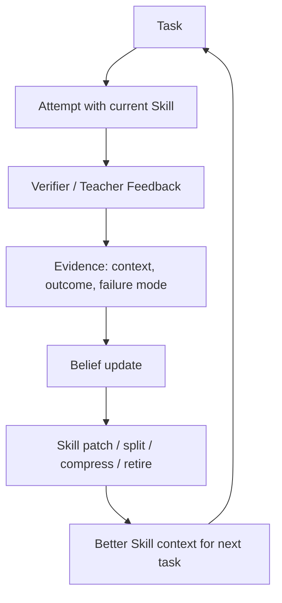
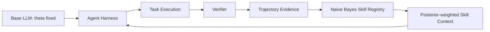

# 从三门问题到 Bayesian-Agent：朴素贝叶斯、后天学习与 Skill 自进化

> 当前的大语言模型已经拥有非常丰富的知识和技能，但很多能力仍然需要被进一步验证。其中最重要的一类能力，是能否从经验和教训中反思，并持续改进自己的 Skills。我们把这种能力称为后天学习 **acquired learning**。


Acquired learning refers to knowledge or skills gained through experience, education, or training.

在大语言模型系统里，这句话有一个很重要的工程含义：后天学习不一定要更新模型参数。预训练、后训练、强化学习、微调改变的是模型参数 `theta`；而 Skill、SOP、记忆、检索证据、失败案例、验证器反馈改变的是推理环境 `C`。

所以我们可以把 LLM Agent 的学习分成两条路：

```text
参数训练学习:      theta -> theta'
非参数后天学习:    C_t -> C_{t+1}
```

Bayesian-Agent 做的是第二条路：不改 base model 的权重，而是从 verified trajectories 中学习 Skill 的可靠性、适用场景、失败模式和成本，让下一次推理拿到更好的条件。**也就是经验和教训（成功的轨迹我们称之为经验，失败的轨迹我们称之为教训）**。
或者我们也可以成为归纳学习（inductive reasoning，归纳与演绎），贝叶斯推理可以视为用演绎法搭建模型结构，用归纳法（贝叶斯更新）从数据中学习参数/假设。

## 一、从三门问题开始：贝叶斯更新到底在更新什么

贝叶斯公式本身非常简单：

```text
P(H | E) = P(E | H) P(H) / P(E)
```

其中：

| 符号 | 名称 | 含义 |
|---|---|---|
| `H` | Hypothesis / 假设 | 我们想判断真假的事情 |
| `E` | Evidence / 证据 | 我们观察到的新信息 |
| `P(H)` | Prior / 先验 | 看到证据之前，对假设的相信程度 |
| <code>P(E &#124; H)</code> | Likelihood / 似然 | 如果假设为真，观察到该证据的概率 |
| <code>P(H &#124; E)</code> | Posterior / 后验 | 看到证据之后，对假设的更新信念 |
| `P(E)` | Evidence / 边际概率 | 证据整体出现的概率，也起归一化作用 |

也可以写成更常用的比例形式：

```text
posterior ∝ likelihood * prior
```

也就是：

```text
新的信念 ∝ 证据在该假设下出现的概率 * 原来的信念
```

三门问题是最经典的贝叶斯直觉测试：

1. 有三扇门，一扇门后面是车，另外两扇门后面是羊。
2. 你先选一扇门，比如 A。
3. 主持人知道答案，并打开另一扇有羊的门，比如 B。
4. 你现在可以坚持 A，也可以换到 C。

很多人的直觉会说：现在只剩两扇门，所以 A 和 C 各有 `1/2`。但正确答案是：应该换门，换到 C 的胜率是 `2/3`。

关键点是：主持人的行为不是随机噪声，而是有条件的信息。主持人打开 B，不只是“少了一扇门”，而是在告诉你：“在知道车在哪的前提下，我选择打开了 B 这扇羊门。”

设：

```text
H_A: 车在 A 后面
H_C: 车在 C 后面
O_B: 主持人打开 B
```

一开始：

```text
P(H_A) = 1/3
P(H_B) = 1/3
P(H_C) = 1/3
```

当你选 A 后，主持人打开 B。因为主持人不会打开你选的门，也不会打开车门，所以：

```text
P(O_B | H_A) = 1/2
P(O_B | H_C) = 1
P(O_B | H_B) = 0
```

用贝叶斯公式：

```text
P(H_i | O_B) = P(O_B | H_i) P(H_i) / sum_j P(O_B | H_j) P(H_j)
```

这里的对应关系是：

| 项 | 三门问题里的含义 |
|---|---|
| Prior `P(H_i)` | 主持人开门前，车在每扇门后的概率 |
| Likelihood <code>P(O_B &#124; H_i)</code> | 如果车在某扇门后，主持人打开 B 的概率 |
| Posterior <code>P(H_i &#124; O_B)</code> | 主持人打开 B 后，车在某扇门后的概率 |
| Evidence `P(O_B)` | 主持人打开 B 这个事件整体发生的概率 |

于是：

```text
P(H_A | O_B)
= (1/2 * 1/3) / (1/2 * 1/3 + 1 * 1/3 + 0 * 1/3)
= 1/3

P(H_C | O_B)
= (1 * 1/3) / (1/2 * 1/3 + 1 * 1/3 + 0 * 1/3)
= 2/3
```


严格说，三门问题讲的是贝叶斯更新，不是朴素贝叶斯。它只有一个证据事件 `O_B`。朴素贝叶斯要处理的是多个证据特征，下面单独展开。

## 二、朴素贝叶斯：当证据不止一个时怎么办

朴素贝叶斯的目标通常是分类。给定一组特征 `x`，判断它属于哪个标签 `y`：

```text
x = {x_1, x_2, ..., x_m}
y in {class_1, class_2, ...}
```

直接用贝叶斯公式：

```text
P(y | x) = P(x | y) P(y) / P(x)
```

问题是 `x` 不是一个单独事件，而是一组特征：

```text
P(y | x_1, x_2, ..., x_m)
= P(x_1, x_2, ..., x_m | y) P(y) / P(x_1, x_2, ..., x_m)
```

如果特征很多，直接估计联合概率 `P(x_1, x_2, ..., x_m | y)` 会非常困难。朴素贝叶斯的“朴素”就在这里：它假设在给定标签 `y` 后，各个特征近似条件独立：

```text
P(x_1, x_2, ..., x_m | y)
≈ Π_j P(x_j | y)
```

这里的 `Π` 是大写希腊字母 Pi，在数学里表示 **product / 连乘**，不是累加。`Π_j P(x_j | y)` 的意思是：

```text
P(x_1 | y) * P(x_2 | y) * ... * P(x_m | y)
```

于是：

```text
P(y | x)
∝ P(y) Π_j P(x_j | y)
```

归一化以后得到：

```text
P(y = c | x)
= P(c) Π_j P(x_j | c) / sum_{c'} P(c') Π_j P(x_j | c')
```

这里的对应关系是：

| 项 | 朴素贝叶斯里的含义 |
|---|---|
| Prior `P(c)` | 某个类别本来出现的概率 |
| Likelihood <code>Π_j P(x_j &#124; c)</code> | 如果类别是 `c`，这些特征一起出现的概率近似 |
| Posterior <code>P(c &#124; x)</code> | 看到这些特征后，样本属于类别 `c` 的概率 |
| Evidence `P(x)` | 这些特征整体出现的概率，通常用归一化分母处理 |

### 例子：一封邮件是不是垃圾邮件

假设我们要判断一封邮件是不是垃圾邮件：

```text
y in {spam, normal}
```

观察到三个特征：

```text
x_1 = contains_discount      # 邮件里出现“折扣”
x_2 = contains_link          # 邮件里有链接
x_3 = sender_unknown         # 发件人陌生
```

从历史邮件里统计到：

```text
P(spam) = 0.30
P(normal) = 0.70

P(contains_discount | spam) = 0.80
P(contains_link | spam) = 0.70
P(sender_unknown | spam) = 0.60

P(contains_discount | normal) = 0.10
P(contains_link | normal) = 0.20
P(sender_unknown | normal) = 0.05
```

那么这封邮件是垃圾邮件的未归一化分数是：

```text
score(spam)
= P(spam)
  * P(contains_discount | spam)
  * P(contains_link | spam)
  * P(sender_unknown | spam)

= 0.30 * 0.80 * 0.70 * 0.60
= 0.1008
```

普通邮件的未归一化分数是：

```text
score(normal)
= P(normal)
  * P(contains_discount | normal)
  * P(contains_link | normal)
  * P(sender_unknown | normal)

= 0.70 * 0.10 * 0.20 * 0.05
= 0.0007
```

归一化：

```text
P(spam | x)
= score(spam) / (score(spam) + score(normal))
= 0.1008 / (0.1008 + 0.0007)
≈ 0.993
```

所以模型会判断这封邮件大概率是垃圾邮件。

这个例子里：

| 概念 | 对应内容 |
|---|---|
| Prior | `P(spam)` 和 `P(normal)`，历史上垃圾邮件/普通邮件的比例 |
| Likelihood | <code>P(contains_discount &#124; spam)</code> 等特征在某类邮件下出现的概率 |
| Posterior | <code>P(spam &#124; x)</code>，看到这些特征后邮件是垃圾邮件的概率 |
| Naive assumption | 给定 `spam` 或 `normal` 后，折扣、链接、陌生发件人近似独立 |

这就是朴素贝叶斯的直觉：它不需要理解“折扣”和“链接”的深层语义，只要不断从历史样本里统计“哪些特征经常和哪个标签一起出现”，就可以做出可解释的概率判断。

## 三、人的后天学习：一个技能是如何从经验里长出来的

假设一个人正在学习写 SQL 报表。他不是从零拥有“SQL 专家能力”的。最开始，他可能已经知道一些语法：

```text
SELECT, WHERE, GROUP BY, HAVING, ORDER BY
```

这相当于他的先验知识。可是，真正做任务时，他会不断遇到经验和教训：

- 有些任务需要先读表结构，否则会写错列名。
- 有些任务需要 `GROUP BY`，否则聚合结果错误。
- 有些任务要求“只输出一条 SQL”，如果写解释文字就会失败。
- 有些更新任务不能带自增主键列。
- 有些失败不是知识不会，而是没有验证输出。

每一次任务之后，如果有老师、测试用例或数据库执行结果给出反馈，那么这个人就会获得一条 evidence：

```text
e_i = (x_i, y_i)
```

其中：

```text
x_i = {
  task_type,
  schema_complexity,
  required_operator,
  failure_mode,
  verification_signal
}

y_i in {success, failure}
```

如果我们把“先读 schema、再写 SQL、最后执行验证”看成一条 Skill hypothesis `h_sql_verify`，为了避免记号太长，可以把“在这条 Skill 作用域下的概率”写成 `P_h(...)`，其中：

```text
h = h_sql_verify
P_h(y | x) 等价于 P(y | x, h_sql_verify)
```

这和前面垃圾邮件例子里的 `P(spam | x)` 是同一种结构。垃圾邮件例子里，分类器或历史邮件统计这个“模型作用域”是隐含的；到了 Skill 学习里，我们把它显式写出来，因为不同 Skill 会有不同的历史证据和成功率。

于是后天学习可以写成：

```text
P_h(success | x)
∝ P_h(success) Π_j P_h(x_j | success)
```

更完整地写，就是：

```text
P_h(y | x)
= P_h(y) Π_j P_h(x_j | y)
  / sum_{y'} P_h(y') Π_j P_h(x_j | y')
```

这里的 prior、likelihood、posterior 可以一一对应：

| 贝叶斯概念 | 后天学习里的含义 |
|---|---|
| Prior <code>P_h(y)</code> | 在这条 Skill 作用域下，看到当前任务特征前的历史成功/失败倾向 |
| Likelihood <code>Π_j P_h(x_j &#124; y)</code> | 如果这次会成功或失败，那么当前这些任务特征出现的概率 |
| Posterior <code>P_h(y &#124; x)</code> | 看到当前任务特征后，这条 Skill 成功或失败的更新概率 |
| Evidence <code>P_h(x)</code> | 在这条 Skill 作用域下，当前任务特征整体出现的概率，用分母归一化 |

举一个很小的数值例子。学习者过去用 `h_sql_verify` 做过 10 个 SQL 任务，其中 6 次成功、4 次失败。用 `alpha = 1` 做平滑：

```text
P_h(success) = (6 + 1) / (10 + 2) = 7/12
P_h(failure) = (4 + 1) / (10 + 2) = 5/12
```

这就是 prior。现在来了一个新任务，它的特征是：

```text
x_1 = task_type=aggregation
x_2 = required_operator=GROUP_BY
x_3 = verification_signal=executed_ok
```

从过去经验里统计到：

```text
P_h(task_type=aggregation | success) = 4/6
P_h(required_operator=GROUP_BY | success) = 4/6
P_h(verification_signal=executed_ok | success) = 5/6

P_h(task_type=aggregation | failure) = 3/4
P_h(required_operator=GROUP_BY | failure) = 1/4
P_h(verification_signal=executed_ok | failure) = 1/4
```

这些就是 likelihood。于是：

```text
score(success)
= 7/12 * 4/6 * 4/6 * 5/6
≈ 0.216

score(failure)
= 5/12 * 3/4 * 1/4 * 1/4
≈ 0.0195

P_h(success | x)
= 0.216 / (0.216 + 0.0195)
≈ 0.917
```

这就是 posterior。人的直觉说法是：“这类任务我已经掌握了，只要按 checklist 执行验证，成功率很高。”贝叶斯说法是：“在这条 Skill 和这些 evidence features 下，posterior success probability 升高了。”

如果一个学习者反复观察到：

```text
task_type = aggregation
required_operator = GROUP BY
verification_signal = executed_ok
```

这些特征经常和成功一起出现，那么这条 Skill 的 posterior success 就会上升。相反，如果：

```text
failure_mode = missing_group_by
verification_signal = not_executed
```

经常和失败一起出现，那么学习者会形成一个新的经验：

```text
遇到聚合任务时，不要只写 SELECT；必须检查 GROUP BY/HAVING，并执行验证。
```

这就是后天学习。人的大脑参数当然也会变化，但从工程视角看，很多可复用的能力沉淀在外部结构里：

- 笔记
- checklist
- SOP
- 失败案例本
- 测试习惯
- 反思模板
- 面向场景的操作策略

在 LLM Agent 里，这些外部结构就是 Skills、SOPs、memory、tool traces 和 verifier feedback。它们不改变 `theta`，但改变下一次推理的条件：

```text
P(X | theta) -> P(X | theta, C)
```

更进一步，后天学习就是让 `C` 随经验更新：

```text
C_{t+1} = Update(C_t, evidence_t)
```



这和参数训练不同。参数训练是在改变模型内部的 `theta`。后天学习是在改变模型外部的 `C`，让同一个模型在下一次推理时拥有更好的证据、更好的步骤、更好的失败规避策略。

## 四、Bayesian-Agent：把 Skill 当成可验证的假设

Bayesian-Agent 的核心观点是：

> Skill/SOP 不是一段神圣的提示词，而是一个关于“如何让 Agent 成功”的 hypothesis。

记：

```text
h_k = 第 k 条 Skill/SOP hypothesis
x = 当前任务和运行证据特征
y in {success, failure}
```

大语言模型本身拥有丰富知识：

```text
P(X | theta)
```

Agent 系统则会把模型放进某个推理环境里：

```text
P(X | theta, C)
```

这里的 `C` 包括 prompt、tools、memory、RAG、Skill、SOP、历史轨迹和 verifier feedback。Bayesian-Agent 不直接更新 `theta`，而是更新 `C` 中的 Skill belief：

```text
P_{h_k}(success | x)
```

这里的 `P_{h_k}(...)` 表示“在第 `k` 条 Skill/SOP 的证据作用域下计算概率”。它等价于 `P(success | x, h_k)`，只是把 `h_k` 放到下标里，避免读者把 `h_k` 误解成和 `x` 同级的普通特征。

每次 Agent 跑完一个任务，Bayesian-Agent 会收集一条 verified trajectory：

```text
e_i = {
  task_id,
  skill_id,
  context,
  outcome,
  failure_mode,
  input_tokens,
  output_tokens,
  total_tokens,
  turns,
  elapsed_seconds,
  metadata
}
```

这些 evidence 进入 Skill registry，形成每条 Skill 的 posterior belief。

在 Bayesian-Agent 里，对应关系是：

| 贝叶斯概念 | Bayesian-Agent 里的含义 |
|---|---|
| Hypothesis `h_k` | 第 `k` 条 Skill/SOP |
| Evidence `e_i` | 一次经过验证的 agent trajectory |
| Feature `x_i` | context、failure_mode、token_bucket、turn_bucket、latency_bucket、metadata |
| Label `y_i` | verified outcome: `success` 或 `failure` |
| Prior <code>P_{h_k}(y)</code> | 这条 Skill 在已有轨迹里的平滑成功/失败基率 |
| Likelihood <code>P_{h_k}(x_j &#124; y)</code> | 某个 evidence feature 在成功/失败轨迹中出现的概率 |
| Posterior <code>P_{h_k}(y &#124; x)</code> | 给定当前任务特征后，这条 Skill 成功/失败的更新概率 |

## 五、Benchmark 例子：从零进化、失败改写与增量修复

上面的公式还是抽象。下面看几组 benchmark 轨迹，分别展示三种情况：

```text
clean full mode:  从零开始跑，但一路成功，只展示 reliability posterior 上升
failure-in-loop:  从零开始跑，中途失败，posterior failure 上升并触发 Skill rewrite
incremental mode: 读取 baseline 失败，posterior 记录 failure mode，再只重跑失败任务
```

### 例子 A：从零 clean run 时，posterior 如何持续升高

在 full mode 里，Bayesian-Agent 不读取 GA baseline 失败轨迹，而是从空 registry 开始：

```text
success = 0
failure = 0
P_h(success) = 1 / 2 = 0.500
rewrite = explore
```

每完成一个任务，benchmark verifier 会给出 `success` 或 `failure`。Bayesian-Agent 立刻把这条 trajectory 写入 Skill registry，然后下一道题拿到更新后的 posterior-weighted Skill context。

这和“最后统一总结一次经验”不同。它是在线更新：

```text
task_i -> verifier -> evidence_i -> registry_i+1 -> context_i+1 -> task_i+1
```

#### SOP-Bench full mode

SOP-Bench 从零跑时，前几个任务逐步覆盖了不同决策类型：

| Task | Expected/Got | Verified outcome | 更新后的 `P_h(success)` | Rewrite action |
|---|---|---:|---:|---|
| before `sop_01` | no evidence | - | 0.500 | `explore` |
| `sop_01` | `fulfill_immediately` | success | 0.667 | `explore` |
| `sop_02` | `fulfill_immediately` | success | 0.750 | `explore` |
| `sop_03` | `fulfill_delayed` | success | 0.800 | `compress` |
| `sop_04` | `backorder` | success | 0.833 | `compress` |
| `sop_05` | `reject` | success | 0.857 | `compress` |
| after 10 tasks | mixed SOP decisions | 10/10 success | 0.917 | `compress` |
| after 20 tasks | all SOP tasks | 20/20 success | 0.955 | `compress` |

这些数值来自 Laplace smoothing：

```text
P_h(success) = (success + 1) / (success + failure + 2)
```

例如，完成 5 个 SOP 任务且全部成功后：

```text
P_h(success) = (5 + 1) / (5 + 0 + 2) = 6/7 ≈ 0.857
```

这里 Skill 的“持续改写”不是每一步都让 LLM 重新写一份长 SOP，而是让 Skill context 持续被 posterior 校准：

```text
0 条证据: 先探索，遵循基础 guardrails
1-2 条成功证据: posterior 上升，但仍保持 explore
3 条以上稳定成功: rewrite action 变成 compress，说明这条 Skill 已经稳定
持续成功: context 继续保留更高 posterior 和更低不确定性
```

也就是说，从零跑时，Bayesian-Agent 学到的是：

```text
这条 SOP-Bench Skill 在当前 harness/model/context 下越来越可靠。
```

最终 full mode 结果：

```text
SOP-Bench full mode: 20/20 = 100%
posterior_success: 0.955
```

#### Lifelong AgentBench full mode

Lifelong AgentBench 从零跑时，也同样在线更新。前几个任务覆盖了 INSERT、SELECT、UPDATE、GROUP BY/HAVING 等 SQL 技能：

| Task | SQL pattern | Verified outcome | 更新后的 `P_h(success)` | Rewrite action |
|---|---|---:|---:|---|
| before `lifelong_0` | no evidence | - | 0.500 | `explore` |
| `lifelong_0` | INSERT without extra id column | success | 0.667 | `explore` |
| `lifelong_1` | SELECT with filter/limit | success | 0.750 | `explore` |
| `lifelong_2` | GROUP BY + ORDER BY | success | 0.800 | `compress` |
| `lifelong_3` | UPDATE mutation | success | 0.833 | `compress` |
| `lifelong_4` | GROUP BY + HAVING | success | 0.857 | `compress` |
| after 10 tasks | mixed SQL tasks | 10/10 success | 0.917 | `compress` |
| after 20 tasks | all Lifelong tasks | 20/20 success | 0.955 | `compress` |

最终 full mode 结果：

```text
Lifelong AgentBench full mode: 20/20 = 100%
posterior_success: 0.955
```

这个 clean run 展示的是“正向经验”的后天学习：每个 verified success 都会提高这条 Skill 在当前 context 下的 posterior reliability。

要说明“失败 -> 改写 Skill -> 后面类似 case 做对”这条链路，还需要一条带失败的在线轨迹。

### 例子 B：从零跑，中途失败如何触发 Skill rewrite

以 SOP-Bench 的 CSV 写回错误为例。它不改变前面的真实 full-mode 结果；真实 full mode 仍然是 `20/20`。这条轨迹展示同一套 Bayesian update 在“从空 registry 开始，但中途遇到失败”时的行为。

初始时只有一条基础 Skill：

```text
h_base = benchmark/sop_bench
success = 0
failure = 0
P_h_base(success) = 0.500
rewrite = explore
```

前两题成功：

```text
sop_01: success
sop_02: success

P_h_base(success)
= (2 + 1) / (2 + 0 + 2)
= 0.750
```

这时系统还不会改写 Skill，只会认为基础 SOP skill 在当前 harness 下初步可靠。

接下来出现两个相似失败：

```text
sop_13: failure, failure_mode = left_expected_output_blank
sop_14: failure, failure_mode = left_expected_output_blank
```

也就是 Agent 算出了流程，却没有把目标 CSV 行的 `expected_output` 写成非空值。当前观测到的任务特征是：

```text
context = sop_bench
metadata.output_contract = csv_expected_output
failure_mode = left_expected_output_blank
```

这里的 `failure_mode = left_expected_output_blank` 表示“expected_output 留空”这个具体错误类型；它不是 `failure` 标签本身。

此时基础 Skill 的证据是：

```text
success = 2
failure = 2
```

所以 class prior 是：

```text
P_h_base(success) = (2 + 1) / (4 + 2) = 0.500
P_h_base(failure) = (2 + 1) / (4 + 2) = 0.500
```

再看关键 feature 的 likelihood。`failure_mode` 是这次失败中最关键的特征；真实实现还会把 `context`、token bucket、turn bucket、latency bucket 和 metadata 一起连乘进去。

在两条成功轨迹里，`failure_mode = left_expected_output_blank` 出现了 0 次；在两条失败轨迹里，它出现了 2 次。用 Laplace smoothing：

```text
P_h_base(failure_mode = left_expected_output_blank | success)
= (0 + 1) / (2 + 2)
= 0.250

P_h_base(failure_mode = left_expected_output_blank | failure)
= (2 + 1) / (2 + 2)
= 0.750
```

于是朴素贝叶斯 posterior 如下：

```text
score_success
= P(success) * P(failure_mode = left_expected_output_blank | success)
= 0.500 * 0.250
= 0.125

score_failure
= P(failure) * P(failure_mode = left_expected_output_blank | failure)
= 0.500 * 0.750
= 0.375

P_h_base(
    failure
  | context = sop_bench,
    metadata.output_contract = csv_expected_output,
    failure_mode = left_expected_output_blank
)
= 0.375 / (0.125 + 0.375)
= 0.750

P_h_base(
    success
  | context = sop_bench,
    metadata.output_contract = csv_expected_output,
    failure_mode = left_expected_output_blank
)
= 0.250
```

这一步很重要：失败不是让系统“更相信原来的 Skill”，而是让系统更相信：

```text
在 context = sop_bench, metadata.output_contract = csv_expected_output,
failure_mode = left_expected_output_blank 这个条件下，
h_base 很可能继续失败。
```

因此 rewrite policy 不应该 `compress`，而应该 `patch` 或 `split`：

```text
rewrite = patch
reason = failures cluster around left_expected_output_blank
```

改写后的 Skill context 不是泛泛地说“仔细一点”，而是把失败模式变成可执行约束。当前 v0.x 实现会在下一轮 prompt 里注入类似这样的 patch section：

```text
### Bayesian Failure-Mode Patches: sop_bench
- failure_mode=left_expected_output_blank observed=2
  - After writing, re-read test_set_with_outputs.csv and confirm the target row's expected_output is non-empty.
  - If the target cell is empty, write the computed raw category string before finishing.
```

然后用改写后的 Skill context 继续处理相似任务。后续成功会回写到同一条 benchmark Skill；失败历史不会被洗掉，posterior 会在保留 failure-mode 记忆的同时重新上升：

| Step | Evidence | Prior | Likelihood signal | Posterior | Skill action |
|---|---|---:|---|---:|---|
| before rewrite | 2 success + 2 failure | <code>P_h_base(success)=0.500</code> | recurring empty output failure | 0.500 | patch |
| retry `sop_13` | repaired success | 0.500 | patch applied and verified | <code>(3+1)/(5+2)=0.571</code> | keep patch |
| retry `sop_14` | similar repaired success | 0.571 | same CSV writeback contract | <code>(4+1)/(6+2)=0.625</code> | keep patch |
| later `sop_20` | similar output-contract case succeeds | 0.625 | `left_expected_output_blank` no longer appears | <code>(5+1)/(7+2)=0.667</code> | less uncertain |

这才是“持续改写 Skill -> 后验持续升高”的完整链条：

```text
先验:
  h_base 对 SOP-Bench 只有不确定的成功率

失败证据:
  expected_output 留空这个失败模式连续出现

似然:
  P(failure_mode = left_expected_output_blank | failure)
  远高于
  P(failure_mode = left_expected_output_blank | success)

后验:
  P_h_base(failure | context=sop_bench, metadata.output_contract=csv_expected_output,
  failure_mode=left_expected_output_blank) 上升到 0.750

rewrite:
  注入 failure-mode-specific patch context，显式约束 raw category + non-empty verification

后续相似 case:
  带 patch context 的 Skill 连续成功

新的后验:
  P_h_base(success) 从 0.500 -> 0.571 -> 0.625 -> 0.667
```

换句话说，Bayesian-Agent 里的“后验升高”有两种不同含义：

```text
正向经验:
  success evidence 让同一条 Skill 的 posterior_success 升高

失败改写:
  failure evidence 先让原 Skill 在某个条件下的 posterior_failure 升高，
  触发 patch/split，
  然后带 patch context 的后续成功轨迹把 posterior_success 拉高
```

### 例子 C：SOP-Bench 写错 CSV 输出格式

SOP-Bench 的任务要求 Agent 阅读 `sop.txt`、`tools.py` 和目标 CSV 行，然后把原始决策字符串写回 `expected_output` 单元格。例如：

```text
manual_review
backorder
fulfill_immediately
```

GA baseline 在 `deepseek-v4-flash` 上的 SOP-Bench 结果是：

```text
16 / 20 = 80%
```

其中一个失败任务是 `sop_12`：

| 项 | 内容 |
|---|---|
| Expected | `manual_review` |
| Baseline got | `<final_decision>manual_review</final_decision>` |
| Failure mode | `wrote_xml_tags_in_csv_expected_output` |
| 失败原因 | 语义对了，但写入 CSV 的格式错了；benchmark 只接受 raw category string |

还有三个失败任务 `sop_13`、`sop_14`、`sop_20` 的共同问题是：

| 项 | 内容 |
|---|---|
| Expected | `backorder` 或 `fulfill_immediately` |
| Baseline got | 空字符串 |
| Failure mode | `left_expected_output_blank` |
| 失败原因 | 没有把目标行的 `expected_output` 写成非空值，或者没有验证写回结果 |

这些失败会进入 Bayesian-Agent 的 evidence：

```text
e_i = {
  skill_id: benchmark/sop_bench,
  context: sop_bench,
  outcome: failure,
  failure_mode: wrote_xml_tags_in_csv_expected_output 或 left_expected_output_blank,
  token_bucket: 10k_100k,
  ...
}
```

在 baseline 之后，`benchmark/sop_bench` 这条 Skill 的标签统计是：

```text
success = 16
failure = 4
```

用 `alpha = 1` 平滑：

```text
P_h(success) = (16 + 1) / (20 + 2) ≈ 0.773
P_h(failure) = (4 + 1) / (20 + 2) ≈ 0.227
```

更重要的是，failure mode 的似然被记录下来：

```text
P_h(failure_mode=left_expected_output_blank | failure) 较高
P_h(failure_mode=wrote_xml_tags_in_csv_expected_output | failure) 被显式记录
```

于是下一次 Bayesian context 不是泛泛地说“做得更好”，而是把失败转成更具体的 SOP guardrails：

```text
- Read sop.txt, tools.py, and the target CSV row before acting.
- The requested row is one-indexed after the header; update rows[row_index - 1].
- Compute only the target row and write only its expected_output cell.
- Write the raw category string only; never write XML tags, Markdown, quotes, or explanations.
- Verify the target row's expected_output is non-empty before finishing.
```

这就是 Skill 的后天学习：失败不是被丢掉，而是变成下一次推理环境里的条件。

incremental repair 只重跑 4 个失败任务，结果是：

| Task | Baseline | Bayesian repair |
|---|---|---|
| `sop_12` | `<final_decision>manual_review</final_decision>` | `manual_review` |
| `sop_13` | 空字符串 | `backorder` |
| `sop_14` | 空字符串 | `fulfill_immediately` |
| `sop_20` | 空字符串 | `fulfill_immediately` |

最终：

```text
SOP-Bench: 16/20 -> 20/20
Accuracy: 80% -> 100%
Repair cost: 256k extra tokens
```

注意，这里 Bayesian-Agent 没有把失败样本从记忆中删除。修复成功后，registry 里仍然保留 4 条失败 evidence 和 4 条 repair success evidence：

```text
success = 20
failure = 4
P_h(success) = (20 + 1) / (24 + 2) ≈ 0.808
```

这很重要：posterior belief 不是盲目乐观地变成 100%，而是保留“这条 Skill 曾经在这些 failure modes 上出错”的校准信息。最终任务成功率变成 100%，是因为失败任务被带着更好的 Skill context 重跑并修好了。

### 例子 D：Lifelong-Bench SQL 任务写入了不该写的列

Lifelong AgentBench 的任务要求 Agent 根据 `task.json` 生成 SQL，并用数据库执行结果验证。

GA baseline 在 `deepseek-v4-flash` 上的 Lifelong 结果是：

```text
18 / 20 = 90%
```

其中一个失败任务是 `lifelong_0`。任务要求插入会员支付记录，正确 SQL 是：

```sql
INSERT INTO membership_payments
  (member_id, payment_date, amount, payment_method)
VALUES
  (102, '2023-10-15', 75, 'Credit Card');
```

baseline 写成了：

```sql
INSERT INTO membership_payments
  (payment_id, member_id, payment_date, amount, payment_method)
VALUES
  (26, 102, '2023-10-15', 75, 'Credit Card');
```

它多写了 `payment_id`，也就是自增主键/未请求列。Bayesian-Agent 将其归入：

```text
failure_mode = invented_unrequested_column
```

另一个失败任务是 `lifelong_19`。baseline 没有只写 SQL，而是把 agent transcript 也写进了答案，导致执行时报错：

```text
near "Turn": syntax error
```

Bayesian-Agent 将其归入：

```text
failure_mode = wrote_transcript_instead_of_sql_after_workspace_confusion
```

这两类失败进入 registry：

```text
success = 18
failure = 2

P_h(success) = (18 + 1) / (20 + 2) ≈ 0.864
P_h(failure) = (2 + 1) / (20 + 2) ≈ 0.136
```

下一次 Lifelong context 会突出这些教训：

```text
- Read task.json in the current workspace; do not inspect sibling benchmark runs.
- Write exactly one SQL statement to answer.sql; no Markdown and no explanation.
- Use only columns present in task.json unless the instruction explicitly asks for a new value.
- For INSERT statements, do not include id or primary-key columns unless the instruction explicitly provides their values.
- For mutation tasks, write executable SQL that reproduces the expected table state.
```

repair 只重跑两个失败任务：

| Task | Baseline failure | Bayesian repair |
|---|---|---|
| `lifelong_0` | 多写 `payment_id` | 去掉 `payment_id`，只插入指定字段 |
| `lifelong_19` | 把 transcript 写进 SQL | 只输出一个可执行 `DELETE` SQL |

最终：

```text
Lifelong AgentBench: 18/20 -> 20/20
Accuracy: 90% -> 100%
Repair cost: 122k extra tokens
```

这几组例子说明：Bayesian-Agent 的“持续改进 Skill”不是一句口号，而是三条可检查的链条。

从零 clean run 时：

```text
成功轨迹
-> Naive Bayes posterior 上升
-> rewrite action 从 explore 变成 compress
-> posterior-weighted Skill context 更稳定
-> 下一轮任务继续验证
```

从零 failure-in-loop 时：

```text
失败轨迹
-> failure feature 的 likelihood 被记录
-> 原 Skill 在相似条件下的 posterior_failure 上升
-> rewrite action 变成 patch 或 split
-> rewritten Skill 处理相似 case
-> 成功轨迹回写 registry
-> rewritten Skill 的 posterior_success 上升
```

增量修复时：

```text
失败轨迹
-> failure_mode
-> Naive Bayes belief update
-> posterior-weighted Skill context
-> 只重跑失败任务
-> 成功轨迹回写 registry
-> 下一轮 Skill 更可靠
```

## 六、从 Beta-Bernoulli 到 Naive Bayes

最简单的贝叶斯 Skill update 是 Beta-Bernoulli。对一条 Skill `h_k`，只看成功和失败次数：

```text
p_k ~ Beta(alpha_0, beta_0)
y_i ~ Bernoulli(p_k)
```

观察到 `s_k` 次成功、`f_k` 次失败后：

```text
p_k | D_k ~ Beta(alpha_0 + s_k, beta_0 + f_k)
E[p_k | D_k] = (alpha_0 + s_k) / (alpha_0 + beta_0 + s_k + f_k)
```

这个模型很清晰，但它有一个问题：它只知道“这条 Skill 总体成功率是多少”，不知道“它在哪类 context 下成功，在哪类 failure mode 下失败”。

于是我们升级到 Naive Bayes。

Bayesian-Agent 当前默认把每条 Skill 的 evidence 特征离散化：

```text
x = {
  context,
  failure_mode,
  token_bucket,
  turn_bucket,
  latency_bucket,
  metadata.*
}
```

对每条 Skill `h_k`，维护：

```text
P_{h_k}(y) = (N_y + alpha) / (N + alpha * |Y|)

P_{h_k}(x_j = v | y)
= (N_{j,v,y} + alpha) / (N_{j,y} + alpha * |V_j|)
```

预测当前 context 下这条 Skill 的成功率：

```text
P_{h_k}(y = success | x)
∝ P_{h_k}(y = success) Π_j P_{h_k}(x_j | y = success)
```

完整归一化形式是：

```text
P_{h_k}(y = success | x)
= score(success) / (score(success) + score(failure))

score(y)
= P_{h_k}(y) Π_j P_{h_k}(x_j | y)
```

其中：

- `N_y` 是这条 Skill 下某个标签的次数。
- `N_{j,v,y}` 是在标签 `y` 下，第 `j` 个特征取值为 `v` 的次数。
- `|V_j|` 是第 `j` 个特征的取值空间大小。
- `alpha = 1` 是 Laplace smoothing，用来避免未见过的特征导致概率为 0。

直觉上，这相当于让 Agent 形成这样的经验：

```text
这条 Skill 在 SOP-Bench 上通常成功。
这条 Skill 遇到 missing_group_by 这类 failure mode 时要 patch。
这条 Skill 在高 token bucket 下可能变慢。
这条 Skill 在 SQL mutation tasks 里必须先检查主键列。
```

它不是凭感觉记忆，而是把每次 verified outcome 变成条件概率。

## 七、Bayesian-Agent 的后天学习闭环

Bayesian-Agent 的 acquired learning loop 可以写成：

```text
S_t = Skill registry at time t
e_t = verified trajectory evidence
S_{t+1} = BayesianUpdate(S_t, e_t)
C_{t+1} = RenderContext(S_{t+1}, task_context)
```

下一次推理变成：

```text
P(X | theta, C_{t+1})
```

也就是说，模型参数没变，但推理条件变了。Agent 不再只是“带着一长串记忆继续猜”，而是拿到 posterior-weighted Skill context：

```text
Use these Skills/SOPs as hypotheses, not as unquestioned instructions.
- skill_a: algorithm=naive_bayes, posterior_success=0.95, context_success=0.92, rewrite=compress
- skill_b: algorithm=naive_bayes, posterior_success=0.42, context_success=0.21, rewrite=patch
```



这个过程有三个重要特征：

1. **从零学习**：没有历史 traces 时，Agent 也可以边跑任务边积累 evidence。
2. **增量修复**：已有 Agent 跑失败的任务，可以只把失败轨迹交给 Bayesian-Agent，然后只重跑失败项。
3. **跨 harness 适配**：只要外部 Agent 能产出 trajectory evidence，并能接收 Skill context，就可以接入。

## 八、为什么这是 LLM Agent 的关键能力

当前的大语言模型知识和技能已经非常丰富。很多时候，模型不是“不知道”，而是：

- 没有检查当前文件。
- 没有验证工具输出。
- 没有识别失败模式。
- 没有把上次失败转化成下一次的约束。
- 没有区分这个 Skill 在哪个 context 下可靠。

这就是为什么后天学习很重要。Agent 不应该只依赖参数里的通用能力，也应该有一套运行时的学习机制：

```text
experience -> evidence -> posterior belief -> better Skill -> better context -> better run
```

在我们的 deepseek-v4-flash 实验里，新的 Naive Bayes backend 已经可以作为 acquired learning layer 工作：

| Benchmark | Agent | Accuracy | Input Tokens | Output Tokens | Total Tokens | Efficiency |
|---|---|---:|---:|---:|---:|---:|
| SOP-Bench | GA baseline | 80% | 1.34M | 57k | 1.39M | 11.47 |
| SOP-Bench | Bayesian Naive Bayes full | 100% | 1.13M | 57k | 1.19M | 16.82 |
| SOP-Bench | Bayesian Naive Bayes incremental | 100% | 245k extra | 12k extra | 256k extra | 15.60 |
| Lifelong AgentBench | GA baseline | 90% | 649k | 42k | 690k | 26.07 |
| Lifelong AgentBench | Bayesian Naive Bayes full | 100% | 660k | 48k | 708k | 28.26 |
| Lifelong AgentBench | Bayesian Naive Bayes incremental | 100% | 112k extra | 9k extra | 122k extra | 16.40 |

这组结果说明两件事。

第一，从零运行时，Bayesian-Agent 可以把 verified trajectories 变成 Skill evidence，并在后续任务中持续利用这些 evidence。

第二，增量模式更接近生产环境：一个已有 Agent 先跑，Bayesian-Agent 读取失败轨迹，只对失败任务进行 posterior-guided repair。它不是替换原来的 Agent，而是成为一个即插即用的后天学习层。

## 九、一个更准确的定义

我们可以把 Bayesian-Agent 的 acquired learning 定义为：

```text
Acquired learning for agents is the non-parametric improvement of task behavior
by updating external Skill/SOP beliefs from verified experience,
without changing the base model parameters.
```

中文可以说：

```text
Agent 的后天学习，是指在不更新 base model 参数的情况下，
通过验证过的经验和教训，更新外部 Skill/SOP belief，
从而改善后续任务行为的非参数学习过程。
```

这里的“非参数”不是说整个系统没有参数，而是说它不更新 LLM 的权重 `theta`。它更新的是外部推理环境：

```text
theta 固定
C 持续进化
Skill belief 持续被 evidence 校准
```

这也是 Bayesian-Agent 想表达的核心范式：

```text
Pre-training gives the model knowledge.
Post-training aligns the model behavior.
Acquired learning lets the agent learn from its own verified experience.
```

预训练给模型知识，后训练塑造模型行为，后天学习让 Agent 从自己的经验和教训里持续进化。

## 十、总结

三门问题告诉我们：信息不是“看起来还剩几个选项”，而是“这个证据在不同假设下出现的概率是多少”。

朴素贝叶斯告诉我们：当证据由多个特征组成时，可以用条件独立近似，把每个特征对成功或失败的贡献统计出来。

人的后天学习告诉我们：技能不是一次性写死的规则，而是在经验、反馈和训练中不断校准的操作假设。

Bayesian-Agent 把这些思想落到 LLM Agent 工程里：

```text
Skill = hypothesis
Trajectory = evidence
Verifier = supervision
Naive Bayes = posterior update
Context = non-parametric learned state
Next run = acquired learning in action
```

这就是为什么我们认为 Skill/SOP 的进化会成为 Agent 工程里的核心能力。大模型已经足够聪明，但真正可靠的 Agent 还需要学会一件更朴素也更困难的事：从自己的经验和教训中，持续后天学习。
